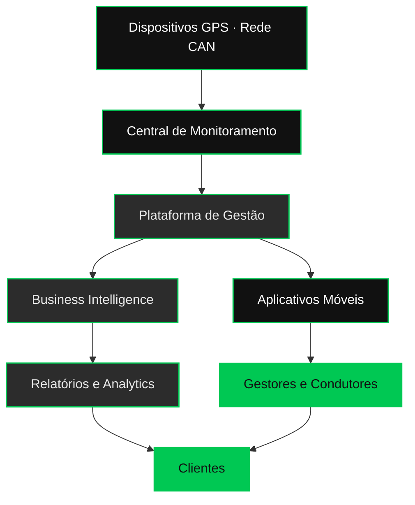

<!-- ============================================================= -->
<!--                    DFLEET · README OFICIAL                    -->
<!-- ============================================================= -->

 

<!-- ============================= HERO ============================= -->

  

<h1>DFleet Fleet Intelligence Platform</h1>

<h3>Transformando dados em decisões inteligentes.</h3>

Tecnologia para gestão de frotas · Rastreamento e Telemetria Avançada · Jaú/SP · Desde 2012

 

<!-- HERO BUTTONS -->

&nbsp;

&nbsp;

  

 

<!-- ========================= APRESENTAÇÃO ========================= -->

### Plataforma de Gestão Inteligente de Frotas

Pioneira em seu segmento desde **2012**, a **DFleet** desenvolve tecnologias e ferramentas inovadoras para otimizar o gerenciamento de frotas. Localizada no interior de São Paulo, gerencia atualmente **mais de 1.000 veículos** em sua plataforma, unindo rastreamento veicular avançado, telemetria e inteligência de dados para entregar **segurança operacional, eficiência e resultados consistentes**.

Nossa missão é **otimizar a gestão de frota** com soluções que garantam eficiência, segurança e sustentabilidade para empresas de diferentes setores — do transporte de cargas ao agronegócio, da pavimentação à mineração. A plataforma converte dados operacionais em **Business Intelligence** acionável, sustentando decisões estratégicas com transparência e precisão.

 

## Nossos Pilares

<table border="0">
<tr>
<td width="25%" align="center"><b>Inovação</b> Tecnologia proprietária em constante evolução</td>
<td width="25%" align="center"><b>Segurança</b> Proteção operacional em tempo real</td>
<td width="25%" align="center"><b>Eficiência</b> Redução de custos e otimização de rotas</td>
<td width="25%" align="center"><b>Sustentabilidade</b> Operações mais limpas e responsáveis</td>
</tr>
</table>

 

## Soluções

<table border="0">
<tr>
<td width="33%" valign="top" align="center">

**Rastreamento Veicular** 
Localização precisa e histórico completo de trajetos

</td>
<td width="33%" valign="top" align="center">

**Telemetria Avançada** 
Dados do veículo em tempo real via rede CAN

</td>
<td width="33%" valign="top" align="center">

**Gestão de Frotas** 
Plataforma central de operação e controle

</td>
</tr>
<tr>
<td valign="top" align="center">

**Business Intelligence** 
Dashboards e relatórios para decisão

</td>
<td valign="top" align="center">

**Controle de Manutenção** 
Preventiva e preditiva com agendamentos

</td>
<td valign="top" align="center">

**Gestão de Abastecimento** 
Controle de combustível e consumo

</td>
</tr>
<tr>
<td valign="top" align="center">

**Gestão de Condutores** 
Desempenho, documentos e comportamento

</td>
<td valign="top" align="center">

**Diagnóstico de Frota** 
Análise de maturidade e pontos de melhoria

</td>
<td valign="top" align="center">

**Portal do Cliente** 
Autoatendimento e total transparência

</td>
</tr>
</table>

 

## Setores Atendidos

<table border="0">
<tr>
<td width="20%" align="center"><b>Transporte de Cargas</b></td>
<td width="20%" align="center"><b>Agronegócio</b></td>
<td width="20%" align="center"><b>Pavimentação</b></td>
<td width="20%" align="center"><b>Mineração</b></td>
<td width="20%" align="center"><b>Frotas Corporativas</b></td>
</tr>
</table>

 

## Arquitetura da Plataforma

 

## Nossos Números

<table border="0">
<tr>
<td width="33%" align="center">

### +1.000
Veículos gerenciados

</td>
<td width="33%" align="center">

### +14
Anos de mercado

</td>
<td width="33%" align="center">

### 2012
Pioneira desde

</td>
</tr>
</table>

 

## Contato

 

&nbsp;

  

DFleet Rastreamento e Telemetria · Jaú · São Paulo · Brasil

 

<!-- ============================ FOOTER ============================ -->

 

© 2026 DFleet Rastreamento e Telemetria · Todos os direitos reservados.

