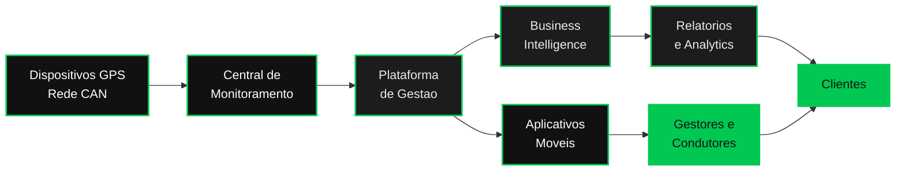

<!-- ============================================================= -->
<!--            DFLEET · FLEET INTELLIGENCE PLATFORM               -->
<!-- ============================================================= -->

 

  

<!-- CREDIBILITY BADGES -->

  

<!-- PRIMARY ACTIONS -->

&nbsp;

&nbsp;

  

 

<!-- ========================= MANIFESTO ========================= -->

<h2>Inteligência que move frotas inteiras.</h2>

<em>A plataforma que transforma cada quilômetro em decisão estratégica.</em>

 

Pioneira em seu segmento desde **2012**, a **DFleet** desenvolve tecnologia proprietária para o gerenciamento inteligente de frotas. Do interior de São Paulo para todo o Brasil, gerenciamos **mais de 1.000 veículos** em nossa plataforma — unindo rastreamento avançado, telemetria em tempo real e inteligência de dados para entregar **segurança operacional, eficiência e resultados mensuráveis**.

Nossa missão é clara: **otimizar a gestão de frota** com soluções que garantam eficiência, segurança e sustentabilidade para empresas de qualquer porte e setor. Cada dado operacional é convertido em **Business Intelligence** acionável, sustentando decisões com transparência, precisão e visão de futuro.

 

 

<!-- ========================= PILARES ========================= -->

## Nossos Pilares

Os princípios que sustentam cada solução que entregamos.

  

<table border="0" cellspacing="0" cellpadding="16">
<tr>
<td width="25%" align="center" valign="top">

**◆ Inovação**

Tecnologia proprietária em evolução contínua

</td>
<td width="25%" align="center" valign="top">

**◆ Segurança**

Proteção operacional em tempo real

</td>
<td width="25%" align="center" valign="top">

**◆ Eficiência**

Redução de custos e otimização de rotas

</td>
<td width="25%" align="center" valign="top">

**◆ Sustentabilidade**

Operações mais limpas e responsáveis

</td>
</tr>
</table>

 

 

<!-- ========================= SOLUÇÕES ========================= -->

## Soluções

Um ecossistema completo para gerenciar sua frota de ponta a ponta.

  

<table border="0" cellspacing="0" cellpadding="18">
<tr>
<td width="33%" valign="top" align="center">

**Rastreamento Veicular**

Localização precisa e histórico completo de trajetos

</td>
<td width="33%" valign="top" align="center">

**Telemetria Avançada**

Dados do veículo em tempo real via rede CAN

</td>
<td width="33%" valign="top" align="center">

**Gestão de Frotas**

Plataforma central de operação e controle

</td>
</tr>
<tr>
<td valign="top" align="center">

**Business Intelligence**

Dashboards e relatórios para decisão

</td>
<td valign="top" align="center">

**Controle de Manutenção**

Preventiva e preditiva com agendamentos

</td>
<td valign="top" align="center">

**Gestão de Abastecimento**

Controle de combustível e consumo

</td>
</tr>
<tr>
<td valign="top" align="center">

**Gestão de Condutores**

Desempenho, documentos e comportamento

</td>
<td valign="top" align="center">

**Diagnóstico de Frota**

Análise de maturidade e pontos de melhoria

</td>
<td valign="top" align="center">

**Portal do Cliente**

Autoatendimento e total transparência

</td>
</tr>
</table>

 

 

<!-- ========================= DIFERENCIAIS ========================= -->

## Por que DFleet

O que nos posiciona à frente no mercado de gestão de frotas.

  

<table border="0" cellspacing="0" cellpadding="16">
<tr>
<td width="33%" align="center" valign="top">

**Tecnologia Própria**

Sistema desenvolvido internamente, com personalização total e adaptação rápida a cada operação.

</td>
<td width="33%" align="center" valign="top">

**Tempo Real**

Monitoramento contínuo com dados precisos e histórico completo para decisões imediatas.

</td>
<td width="33%" align="center" valign="top">

**Resultados Comprovados**

Redução de custos, mais segurança e ganhos reais de produtividade na operação.

</td>
</tr>
</table>

 

 

<!-- ========================= SETORES ========================= -->

## Setores Atendidos

 

 

 

 

<!-- ========================= ARQUITETURA ========================= -->

## Arquitetura da Plataforma

Do dispositivo em campo à decisão estratégica do cliente.

 

 

 

<!-- ========================= NÚMEROS ========================= -->

## DFleet em Números

 

<table border="0" cellspacing="0" cellpadding="24">
<tr>
<td width="33%" align="center">

# +1.000

**Veículos gerenciados**

</td>
<td width="33%" align="center">

# +14

**Anos de mercado**

</td>
<td width="33%" align="center">

# 2012

**Pioneira desde**

</td>
</tr>
</table>

 

 

<!-- ========================= CTA / CONTATO ========================= -->

## Vamos otimizar a sua frota.

Fale com um especialista e descubra o potencial da sua operação.

  

&nbsp;

&nbsp;

  

<!-- ========================= FOOTER ========================= -->

 

© 2026 DFleet Rastreamento e Telemetria · Todos os direitos reservados.

