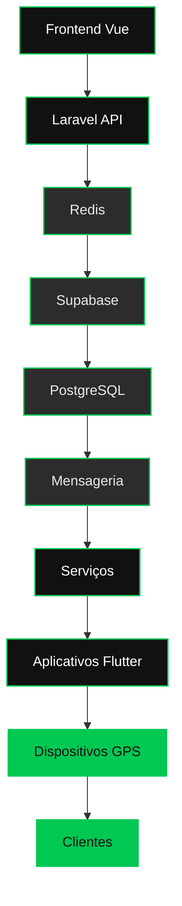
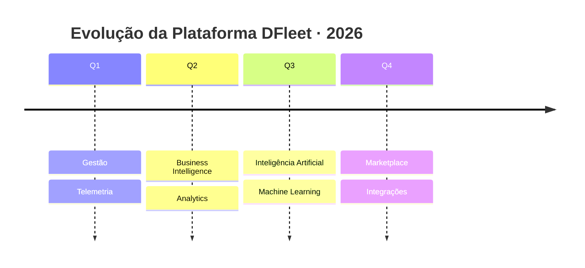

<!-- ============================================================= -->
<!--                    DFLEET · README OFICIAL                    -->
<!-- ============================================================= -->

 

<!-- ============================= HERO ============================= -->

<h3>Transformando dados em decisões inteligentes.</h3>

 

<!-- HERO BANNER (arquivo SVG hospedado no repo) -->

  

<!-- HERO BUTTONS -->

&nbsp;

&nbsp;

&nbsp;

  

 

<!-- ========================= APRESENTAÇÃO ========================= -->

### Plataforma de Gestão Inteligente de Frotas

A **DFleet** é uma plataforma corporativa de **gestão inteligente de frotas** que une engenharia de dados, telemetria e inteligência artificial em um ecossistema único e escalável. Com mais de **14 anos de mercado**, entregamos infraestrutura de nível *Enterprise* para operações que exigem precisão, disponibilidade e visibilidade total.

Nossa plataforma integra **Gestão de Frotas**, **Telemetria** e **Rastreamento** em tempo real com camadas avançadas de **Business Intelligence** e **Inteligência Artificial**, convertendo grandes volumes de dados operacionais em **Analytics** acionáveis e **Dashboards** executivos. Incorporamos pilares de **ESG** e **Logística Regenerativa** para operações mais eficientes e sustentáveis, sustentados por fluxos de **Automação** que reduzem custos e elevam a performance de cada veículo.

 

 

<!-- ============================ BADGES ============================ -->

 

 

## Produtos

<table border="0">
<tr>
<td width="33%" valign="top" align="center">

**DFleet Solution** 
Plataforma central de gestão de frotas

</td>
<td width="33%" valign="top" align="center">

**Greenvia** 
Roteirização Regenerativa™

</td>
<td width="33%" valign="top" align="center">

**Driver App** 
Aplicativo do condutor em Flutter

</td>
</tr>
<tr>
<td valign="top" align="center">

**Painel Administrativo** 
Central de operações e gestão

</td>
<td valign="top" align="center">

**Portal do Cliente** 
Autoatendimento e transparência

</td>
<td valign="top" align="center">

**API Platform** 
Integrações REST e OpenAPI

</td>
</tr>
<tr>
<td valign="top" align="center">

**Business Intelligence** 
Dashboards e analytics executivos

</td>
<td valign="top" align="center">

**Telemetria** 
Dados de veículo em tempo real

</td>
<td valign="top" align="center">

**Controle de Manutenção** 
Preventiva e corretiva

</td>
</tr>
<tr>
<td valign="top" align="center">

**Gestão de Abastecimento** 
Controle de combustível e consumo

</td>
<td valign="top" align="center">

**Gestão de Condutores** 
Perfil, documentos e desempenho

</td>
<td valign="top" align="center">

**Controle de Custos** 
TCO e indicadores financeiros

</td>
</tr>
</table>

 

## Diferenciais

<table border="0">
<tr>
<td width="25%" align="center"><b>Cloud Native</b> Infraestrutura elástica</td>
<td width="25%" align="center"><b>Alta Disponibilidade</b> Uptime corporativo</td>
<td width="25%" align="center"><b>Tempo Real</b> Streaming de dados</td>
<td width="25%" align="center"><b>APIs</b> REST · OpenAPI</td>
</tr>
<tr>
<td align="center"><b>Machine Learning</b> Modelos preditivos</td>
<td align="center"><b>Escalabilidade</b> Horizontal e vertical</td>
<td align="center"><b>Segurança</b> Criptografia end-to-end</td>
<td align="center"><b>LGPD</b> Conformidade total</td>
</tr>
<tr>
<td align="center"><b>Arquitetura Modular</b> Componentização</td>
<td align="center"><b>Integrações</b> Ecossistema aberto</td>
<td align="center"><b>Multiempresa</b> Multi-tenant nativo</td>
<td align="center"><b>Performance</b> Baixa latência</td>
</tr>
</table>

 

## Tecnologias

 

 

 

## Arquitetura

 

## Módulos

<table border="0">
<tr>
<td width="25%" align="center"><b>Gestão de Veículos</b></td>
<td width="25%" align="center"><b>Gestão de Condutores</b></td>
<td width="25%" align="center"><b>Gestão de Documentos</b></td>
<td width="25%" align="center"><b>Gestão de Despesas</b></td>
</tr>
<tr>
<td align="center"><b>Gestão de Multas</b></td>
<td align="center"><b>Gestão de Manutenção</b></td>
<td align="center"><b>Controle de Estoque</b></td>
<td align="center"><b>Telemetria</b></td>
</tr>
<tr>
<td align="center"><b>Mapa</b></td>
<td align="center"><b>Alertas</b></td>
<td align="center"><b>Financeiro</b></td>
<td align="center"><b>Relatórios</b></td>
</tr>
<tr>
<td align="center" colspan="4"><b>Dashboard</b></td>
</tr>
</table>

 

## Roadmap 2026

 

## Estatísticas

 

  

 

  

 

## Interface

<table border="0">
<tr>
<td width="60%" align="center">

</td>
<td width="40%" align="center">

 

</td>
</tr>
<tr>
<td align="center">

</td>
<td align="center">

</td>
</tr>
</table>

 

## Contato

 

 

<!-- ============================ FOOTER ============================ -->

 

© 2026 DFleet Rastreamento e Telemetria · Todos os direitos reservados.

